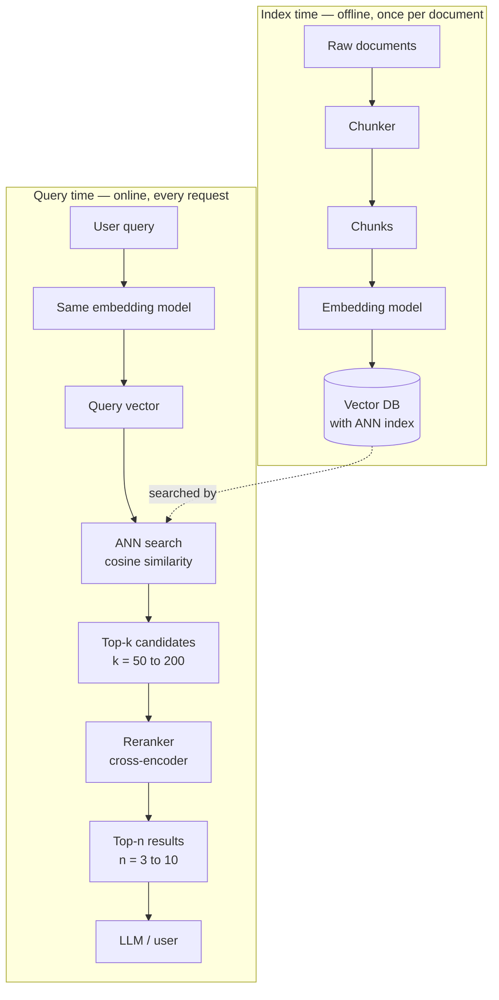
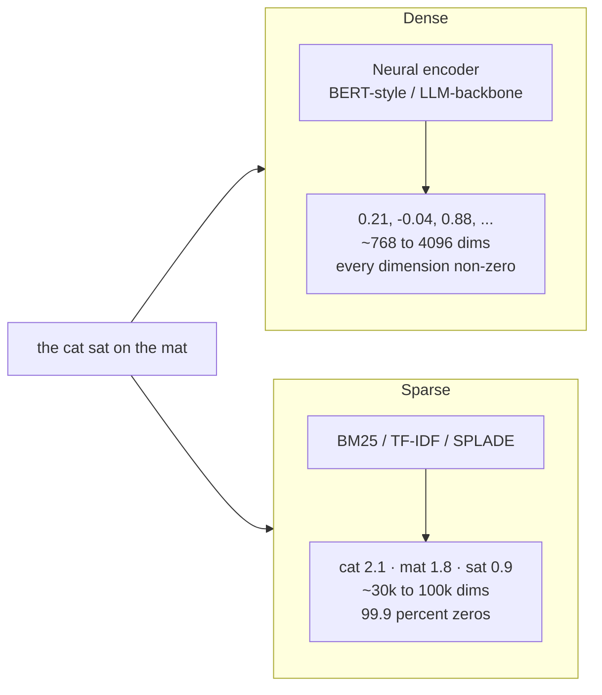
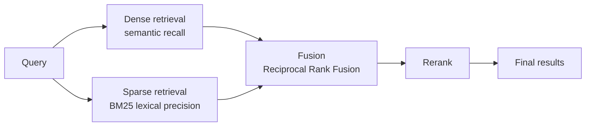
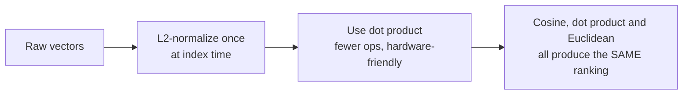
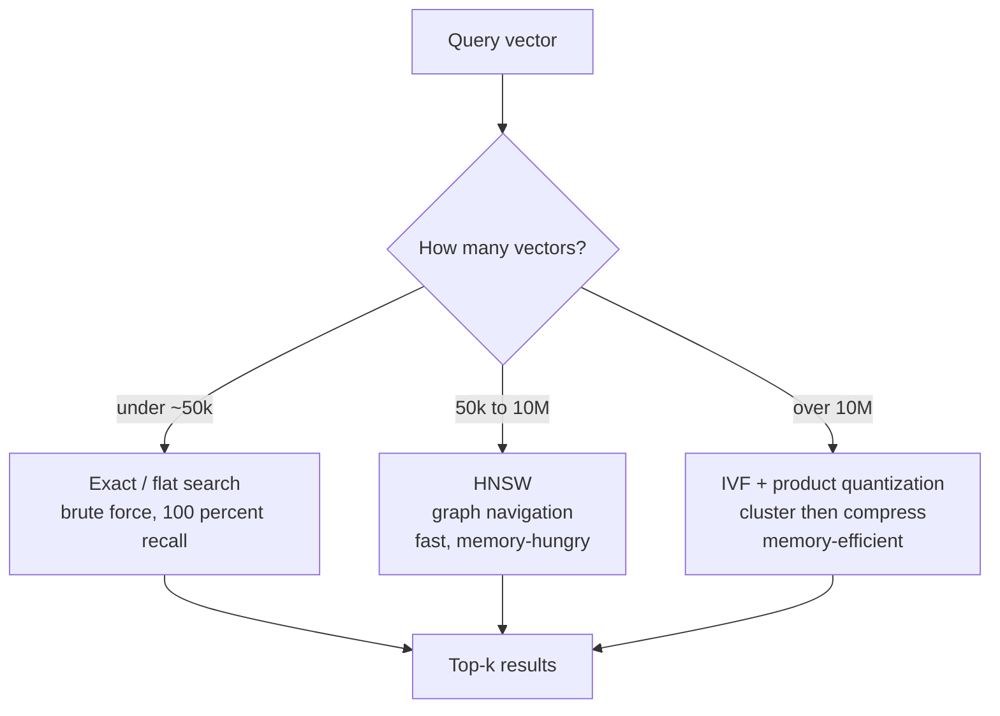
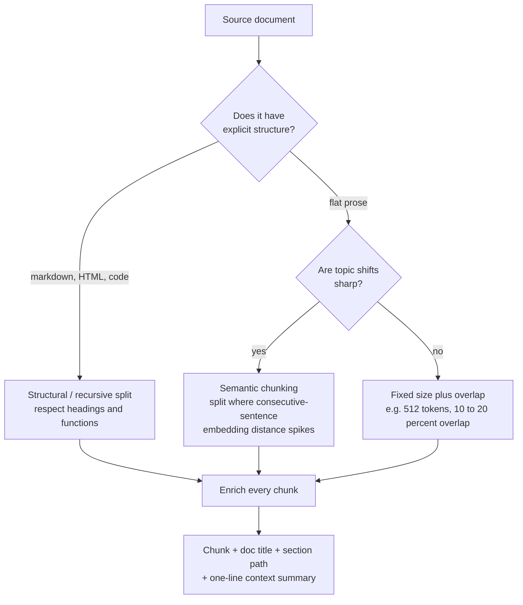
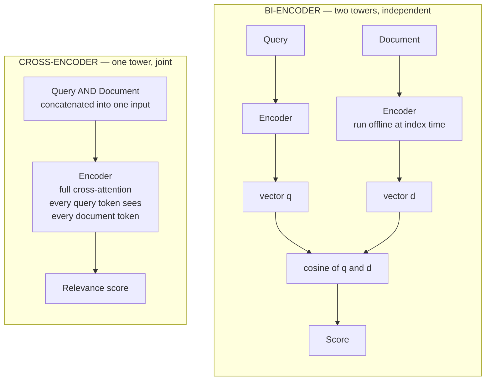
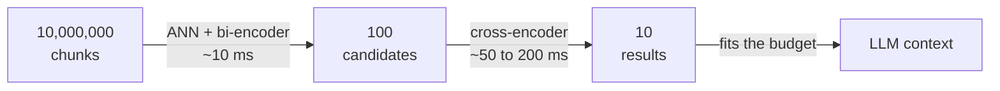

# Embeddings & Retrieval — Study Notes

> Covers: dense vs sparse embeddings · cosine similarity · semantic search · chunking · cross-encoder vs bi-encoder · reranking
>
> Mermaid diagrams render on GitHub, GitLab, Obsidian, Notion, and most modern markdown viewers. In VS Code install the *Markdown Preview Mermaid Support* extension.

---

## 0. The mental model

Everything below is one idea applied repeatedly:

> **Turn meaning into geometry.** Once text is a vector, "is this relevant?" becomes "are these two points close?" — and closeness is something a computer can compute a billion times per second.

The rest is engineering: how you make the vectors (embeddings), how you measure closeness (cosine similarity), how you search a huge pile of them fast (ANN), what unit of text you embed (chunking), and how you fix the accuracy you gave up for speed (reranking).

---

## 1. The whole pipeline at a glance

Two separate phases that people constantly conflate. Indexing happens once, offline. Querying happens per request, and its latency budget is what forces every design compromise.



**The single most important rule on this page:** the query and the documents must be embedded by *the same model*. Different models produce vectors in different, incompatible spaces. Comparing across them gives numbers that look fine and mean nothing.

---

## 2. What an embedding actually is

An embedding is a function `text → fixed-length vector of floats`, trained so that **semantic similarity becomes geometric proximity**.

```
"the cat sat on the mat"   →  [ 0.21, -0.04,  0.88, ...,  0.13]   (1024 floats)
"a feline rested on a rug" →  [ 0.19, -0.07,  0.85, ...,  0.15]   ← close by
"quarterly revenue report" →  [-0.62,  0.44, -0.11, ..., -0.30]   ← far away
```

Individual dimensions are **not interpretable**. There is no "cat-ness" dimension. Meaning lives in the *direction* of the whole vector, not in any coordinate.

How they're trained (in one line): **contrastive learning** — pull known-related pairs together, push random pairs apart. This is why embeddings are good at "these are about the same thing" and mediocre at "these are logically consistent," "this one is newer," or "this one is negated." An embedding cannot reliably tell *"the drug is safe"* from *"the drug is not safe"* — the vectors are nearly identical. Do not ask it to.

---

## 3. Dense vs sparse embeddings

Two fundamentally different ways to vectorize text, with opposite failure modes.



| | **Dense** | **Sparse** |
|---|---|---|
| Dimensions | 384 – 4096 | vocabulary size (30k+) |
| Occupancy | all non-zero | almost all zero |
| Captures | meaning, paraphrase, synonyms | exact terms, rare tokens |
| Built by | trained neural network | term statistics, or a trained model that predicts term weights (SPLADE) |
| Finds "car" for query "automobile"? | yes | no |
| Finds product code `XJ-4471B`? | often no | yes |
| Out-of-domain jargon | degrades badly | works fine |
| Storage | small, fixed | large but compressible |
| Explainable? | no | yes — you can see which terms matched |

**Key intuition:** dense embeddings generalize; sparse embeddings are precise. Dense fails on rare, exact strings it never saw in training — part numbers, error codes, surnames, internal acronyms. Sparse fails on anything requiring paraphrase.

### Hybrid search — use both

In production this is not a hard choice. Run both and fuse.



**Reciprocal Rank Fusion (RRF)** is the standard fusion method because it needs no score calibration — it uses only *ranks*, which sidesteps the fact that BM25 scores and cosine scores live on incomparable scales:

```
RRF_score(doc) = Σ over each retriever   1 / (k + rank_in_that_retriever)
                                          with k ≈ 60
```

A document ranked #1 by one retriever and #40 by the other still beats a document ranked #15 by both. That is usually the behaviour you want.

---

## 4. Cosine similarity

The default way to compare two embeddings.

```
                    A · B              Σ Aᵢ Bᵢ
cos(A, B)  =  ───────────────  =  ───────────────────────
                ‖A‖ · ‖B‖         √(Σ Aᵢ²) · √(Σ Bᵢ²)
```

It is the **cosine of the angle between two vectors**. Range `[-1, 1]`:

| Value | Meaning |
|---|---|
| `1.0` | same direction — semantically identical |
| `0.0` | orthogonal — unrelated |
| `-1.0` | opposite direction |

### Why cosine and not Euclidean distance

Because cosine **ignores magnitude and looks only at direction**. A 200-word and a 2000-word article on the same topic should score as similar, but their vectors may have quite different lengths. Dividing by both norms cancels that out.

### The normalization trick (this is the practical takeaway)

If you **L2-normalize every vector at index time** so that `‖v‖ = 1`, then the denominator becomes 1 and:

```
cos(A, B)  =  A · B                    ← cosine IS the dot product
‖A − B‖²   =  2 − 2·cos(A, B)          ← Euclidean is monotonic in cosine
```

Which means:



So: **normalize once, then use dot product.** You get cosine semantics at lower cost. Most vector DBs do this for you if you select the cosine metric — check, because some silently don't.

### Traps

- **Absolute scores are not comparable across models.** One model's "0.75 = relevant" is another's "0.75 = unrelated." Cosine values from contrastively trained models often bunch into a narrow band (say 0.6–0.9), so a fixed global threshold is fragile. Rank relatively; tune any threshold on your own labelled data.
- **Cosine similarity is not relevance.** It measures topical similarity. A query and a document can be maximally similar and still be a wrong answer — the document may state the opposite, be outdated, or be a question rather than an answer. This gap is precisely what reranking exists to close.
- **Asymmetry.** Queries are short, documents are long. Many modern models require a *prefix* like `query:` vs `passage:`, or an instruction string. Omitting it can cost you a lot of accuracy for free. Read the model card.

---

## 5. Semantic search

Semantic search = embed the query, find the nearest document vectors.

Exact nearest-neighbour search is O(N) per query — fine for 10k vectors, hopeless for 10M. So production uses **ANN (Approximate Nearest Neighbour)**: trade a small amount of recall for orders of magnitude in speed.



**HNSW** in one sentence: build a multi-layer graph where sparse upper layers let you take huge jumps across the space and dense lower layers refine locally — like a skip list in high dimensions. Tuning knobs are `M` (graph connectivity) and `efSearch` (how hard to look at query time); raising `efSearch` buys recall with latency, and it's adjustable *without* rebuilding the index.

**The metric that matters is `recall@k`** — of the true top-k nearest neighbours, what fraction did ANN actually return? Not latency, not QPS. If recall@100 is 0.7, you have silently thrown away 30% of your best candidates before the reranker ever sees them, and no downstream component can recover them.

---

## 6. Chunking

You cannot embed a 300-page PDF as one vector — you would average away all the specifics into meaningless mush. So you split. **Chunking is the highest-leverage and most-neglected part of the whole pipeline.** Bad chunks cannot be rescued by a better embedding model or a better reranker.

Two failure modes, pulling in opposite directions:

- **Chunks too large** → the vector is a blurry average of several topics, and you burn context on irrelevant text.
- **Chunks too small** → the chunk loses the context that makes it meaningful. `"It increased by 34% year over year."` — what did? Which year? Unretrievable and useless if retrieved.



### Strategies, worst to best

1. **Fixed-size, no overlap** — splits mid-sentence, mid-table, mid-thought. Only acceptable as a baseline.
2. **Fixed-size with overlap** — 10–20% overlap so a concept straddling a boundary survives in at least one chunk. Cheap, sane default.
3. **Recursive / structural** — split on the strongest available separator first (`\n## ` → `\n\n` → `\n` → sentence), falling back only when a piece is still too big. Respects the author's own structure. **Best default for markdown, HTML, and code.**
4. **Semantic chunking** — embed sentence by sentence and cut where the embedding distance between consecutive sentences spikes. Slower to index, better boundaries on flat prose.
5. **Contextual chunking** — prepend generated context to each chunk before embedding: `"From the 2024 annual report, section 'Cloud Revenue': It increased by 34%..."`. This directly repairs the dangling-pronoun problem and is one of the largest single-change wins available in a RAG pipeline. Costs an LLM call per chunk at index time.

### Practical guidance

- Start at **512 tokens with ~15% overlap** and adjust based on evals, not vibes.
- **Never split a table, code block, or list mid-structure.**
- Store `parent_doc_id`, `section_path`, and `position` as metadata. You will need them for filtering, citation, and for the *small-to-big* trick below.
- **Small-to-big retrieval**: embed and search small precise chunks, but return the larger parent section to the LLM. You get retrieval precision *and* generation context. Very effective, easy to implement.

---

## 7. Bi-encoder vs cross-encoder

The single most important architectural distinction in retrieval. Everything about the two-stage pipeline follows from it.



The difference is **when the query and document meet**.

- In a **bi-encoder** they never meet. Each is encoded alone. The only interaction is a dot product between two finished vectors. Because the document never sees the query, **document vectors can be computed once, offline, and reused forever** — that is what makes billion-scale search possible.
- In a **cross-encoder** they meet at the very first layer and attend to each other throughout. The model can notice *"the query asks for a cause, this passage gives an effect"* or *"this passage explicitly negates the query."* That precision is unreachable for a bi-encoder — but there is nothing to precompute, so scoring 1M documents means **1M forward passes at query time.**

| | **Bi-encoder** | **Cross-encoder** |
|---|---|---|
| Input | query and doc separately | query + doc together |
| Query/doc interaction | none until the final dot product | full cross-attention, all layers |
| Precompute documents? | **yes** | **no** |
| Cost to score N docs | 1 encode + N dot products | **N** full forward passes |
| Latency for ~1M docs | milliseconds | hours |
| Accuracy | good | **significantly better** |
| Output | a reusable vector | a score for one pair only |
| Role | **retrieval** (stage 1) | **reranking** (stage 2) |

A cross-encoder produces **no embedding at all**. You cannot index with it, cluster with it, or cache it. It only answers "how relevant is *this* document to *this* query?"

> **Late-interaction (ColBERT-style)** sits between the two: keep a vector *per token* instead of per document, then score with a cheap MaxSim operator. Much of the cross-encoder's accuracy at closer to bi-encoder speed, at the cost of a far larger index. Worth knowing about; usually not the first thing to reach for.

---

## 8. Reranking

Reranking is how you get cross-encoder accuracy at bi-encoder scale: **let the fast model choose the candidates, let the slow model order them.**



Stage 1 optimizes **recall** — get the right answer somewhere in the top 100, order doesn't matter. Stage 2 optimizes **precision** — put the best answer at position 1.

### Why it works so well

Retrieval scores are similarity; reranker scores are relevance. The reranker routinely promotes a document from rank 40 to rank 1 because it can read the pair together and see that it actually *answers* the question rather than merely sharing vocabulary with it. This tends to be the largest accuracy gain per line of code in the entire pipeline.

It also matters more than it looks because of **"lost in the middle"**: LLMs attend most strongly to the beginning and end of their context. Even with perfect retrieval, *ordering* affects answer quality. The reranker is what makes position 1 actually be the best document.

### Getting it right

- **Retrieve more than you need.** Reranking the top 10 is nearly pointless — the reranker can only reorder what stage 1 handed it. Retrieve 50–200, rerank down to 3–10. Recall at stage 1 is a hard ceiling on final quality.
- **Budget the latency.** Cross-encoder cost is roughly linear in candidate count × document length. 100 candidates is usually the sweet spot; 1000 usually isn't.
- **Use the reranker score as a cutoff, not just a sort.** Unlike cosine, cross-encoder scores are calibrated enough to threshold. If nothing clears the bar, returning "I don't have this information" beats returning the least-bad irrelevant chunk.
- Reranking fixes **ordering**. It cannot fix **bad chunks** or **missed recall**. If the answer never made the candidate list, no reranker will save you.

---

## 9. Defaults to start from

A reasonable v1 you can then improve with evidence:

| Decision | Start with | Change when |
|---|---|---|
| Chunking | recursive, 512 tokens, 15% overlap | evals show truncated or bloated context |
| Enrichment | prepend doc title + section path | dangling references in retrieved chunks |
| Retrieval | hybrid — dense + BM25, fused with RRF | pure dense misses codes, names, IDs |
| Metric | cosine, vectors L2-normalized | never, basically |
| Index | HNSW (flat below ~50k vectors) | memory pressure → IVF+PQ |
| Candidates | top 100 | recall@100 measured below ~0.95 |
| Rerank | cross-encoder → top 5 | latency budget blown |

On **model choice**: the MTEB leaderboard is the standard comparison point, but scores are self-reported, the rankings shift constantly, and MTEB v2 numbers aren't comparable to v1. Treat the leaderboard as a shortlist generator, not an answer — then **benchmark the top few on your own data**, because domain fit routinely beats a couple of leaderboard points. Match your reranker to your embedding model family where a matched pair exists.

---

## 10. Failure modes to recognize

| Symptom | Likely cause |
|---|---|
| Right topic, useless answer | chunks too large — meaning averaged away |
| Retrieved fragments lack context | chunks too small, no enrichment; try small-to-big |
| Exact IDs / part numbers never found | dense-only retrieval — add BM25 |
| Answer exists but is never retrieved | stage-1 recall problem — check `recall@k` before touching the reranker |
| Good candidates, bad final answer | no reranker, or too few candidates going into it |
| Retrieval breaks on negation | inherent to embeddings — needs a cross-encoder or an LLM filter |
| Great in dev, poor in prod | queries in prod look nothing like your test set; log real queries |
| Everything scores 0.8-ish | normal for contrastive models — rank, don't threshold |

---

## 11. Check yourself

If you can answer these without notes, you have the section:

1. Why can a bi-encoder scale to a billion documents when a cross-encoder can't? What exactly is precomputed?
2. If all your vectors are L2-normalized, why is cosine similarity equal to the dot product — and what does that mean for Euclidean ranking?
3. Your query is `"error XJ-4471B"` and dense retrieval returns nothing useful. Why, and what's the fix?
4. Why does reranking the top 10 gain you almost nothing, while reranking the top 100 gains a lot?
5. A chunk reads `"This grew 34% year over year."` What went wrong at index time, and name two fixes.
6. Why does RRF combine ranks rather than scores?
7. Give an example of two texts with very high cosine similarity where one is a *terrible* answer to the other.
8. Why is `recall@k` a more important stage-1 metric than latency?